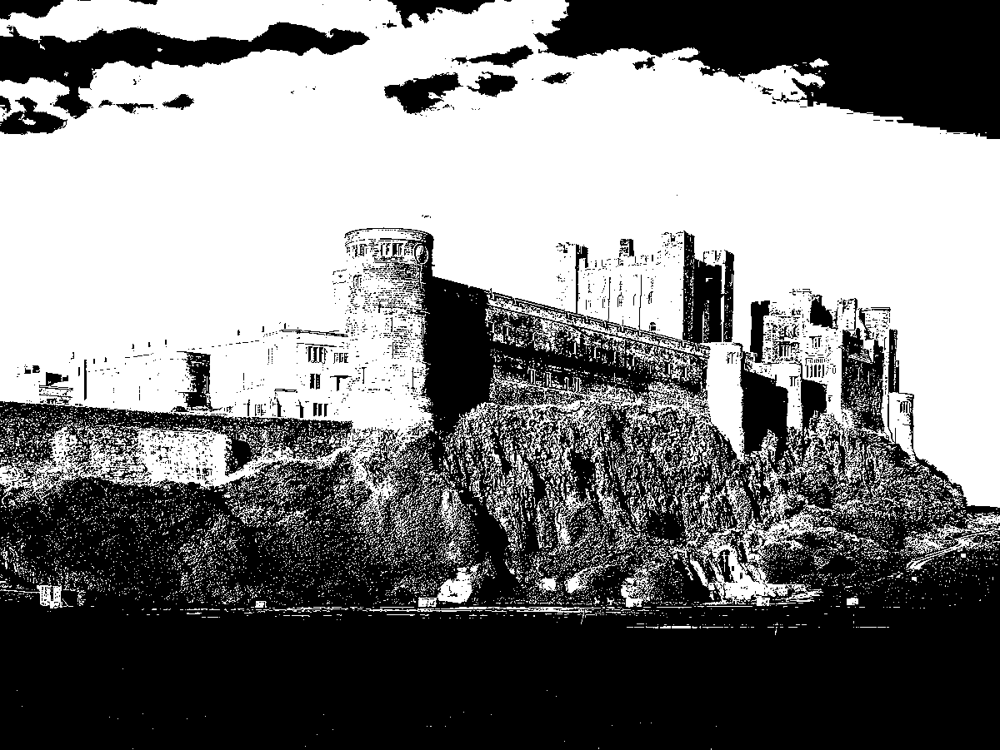

# Thresholding
### Sources
[Wikipedia Thresholding](https://en.wikipedia.org/wiki/Thresholding_(image_processing))  
[A Brief Study of Image Thresholding Algorithms](https://www.analyticsvidhya.com/blog/2022/07/a-brief-study-of-image-thresholding-algorithms/#:~:text=Image%20thresholding%20is%20a%20type,is%20done%20in%20grayscale%20images.)

### Summary
Thresholding is when you take a greyscale image (one channel) and apply a function to each of the pixels according to an
input threshold. For example, you could make any pixels with a value higher than the threshold black and the pixels with
a value smaller than the threshold white. This turns it into a binary image which looks like this:

Check [A Brief Study of Image Thresholding Algorithms](https://www.analyticsvidhya.com/blog/2022/07/a-brief-study-of-image-thresholding-algorithms/#:~:text=Image%20thresholding%20is%20a%20type,is%20done%20in%20grayscale%20images.)
for algorithms used. 

### Otsu's Method

This is a method that attempts to find an optimal thresholding value for an image. It calculates the threshold which
makes the largest variance in intensity between foreground (the would-be white pixels) and background
(the would-be light pixels). [Some nice source code for Otsu's method](https://docs.opencv.org/3.4/d7/d4d/tutorial_py_thresholding.html).
