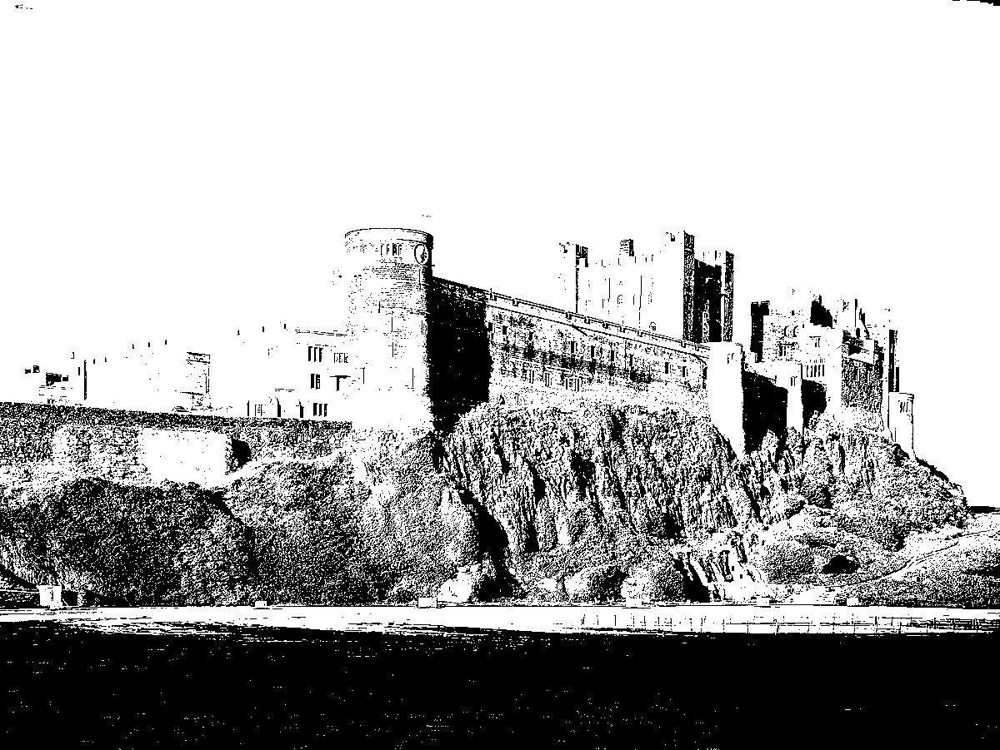

# My Log

## 2023

### April 26 
Started implementing a pixel sorting algorithm, using numpy to quickly do matrix calculations.
The first thing I did was make a function that takes a pixel value (rgb) in and outputs the intensity. (Initially my own 
arbitrary function of just summing the three rgb values)

Then I sorted an array of pixels using this intensity functions with both rows and columns.

### April 27 
My implementation above uses a for loop which is very inefficient, but using only matrix
manipulation would be much more efficient. I started trying to make it work without for loops,
failed so far.

### May 4 
The original pixel sorting algorithm was done by an artist called Kim Asendorf. Today I tried using his method,
which involves doing thresholding the original image to create a binary image and categorise
where the darkest part of the image are. It then only sorts the dark parts of the image. I haven't got it working yet.

I also fixed my function which outputs a pixels intensity by outputting the luminance of the pixel. This is a 
standard value which is calculated from an rbg pixel with the formula
#### (0.2126*R + 0.7152*G + 0.0722*B)

### May 9 

I redid the file system so that each different main task is in a different file.
I also started creating a new editing method by implementing some thresholding. There are multiple different modes you 
can do. 

## Thresholding
### Sources
[Wikipedia Thresholding](https://en.wikipedia.org/wiki/Thresholding_(image_processing))  
[A Brief Study of Image Thresholding Algorithms](https://www.analyticsvidhya.com/blog/2022/07/a-brief-study-of-image-thresholding-algorithms/#:~:text=Image%20thresholding%20is%20a%20type,is%20done%20in%20grayscale%20images.)

### Summary
Thresholding is when you take a greyscale image (one channel) and apply a function to each of the pixels according to an
input threshold. For example, you could make any pixels with a value higher than the threshold black and the pixels with
a value smaller than the threshold white. This turns it into a binary image which looks like this:

Check [A Brief Study of Image Thresholding Algorithms](https://www.analyticsvidhya.com/blog/2022/07/a-brief-study-of-image-thresholding-algorithms/#:~:text=Image%20thresholding%20is%20a%20type,is%20done%20in%20grayscale%20images.)
for algorithms used. 

### Otsu's Method

This is a method that attempts to find an optimal thresholding value for an image. It calculates the threshold which
makes the largest variance in intensity between foreground (the would-be white pixels) and background
(the would-be light pixels). [Some nice source code for Otsu's method](https://docs.opencv.org/3.4/d7/d4d/tutorial_py_thresholding.html).

### June 8
I want to create a UI before carrying on with anything else, the problem is having a UI that
allows you to see how your edits effect the image whilst you are editing it. I'm not sure if you can
do that with tkinter. PyQT may work better.

### July 11 
I started working on a GUI to show the user the images that are actually being edited. I did some research to find a good GUI module to use, as I knew tkinter would not be viable. It was important that the module would have good image tools, so I settled on PyQt, which has good image capabilities with four classes for handling Image Data. QPixmap is the class most important for my project, which handles showing images on screen. In the future I could use the QPicture class to allow painting. [Here is the documentation for PyQt image classes.](https://doc.qt.io/qtforpython-5/PySide2/QtGui/QPixmap.html#PySide2.QtGui.PySide2.QtGui.QPixmap.isQBitmap) Also can do MVC

### July 12
I created a QWindow object which shows a window when you run the program, this is the base which you start to work off implementing widgets. I also added drop down menu buttons for file, edit and about. The file drop down contains the buttons to open, save and exit. The functionality of the buttons comes from the QAction class. This allows you to create functions which can be used in multiple places, for example the user might press file then save, or right click and save. Both of these can be handled by one QAction instance. [QActionDocumentation.](https://doc.qt.io/qtforpython-5/PySide2/QtWidgets/QAction.html) I later created the functionality of opening an image and showing it to the user. When the user triggers the open file action, a file dialog box opens allowing them to pick an image file to be shown (and later edited). The program stores the path of the file and creates a QPixmap instance of it, also storing the raw image data of the file to be sent to the model to manipulate for editing. It then sets the pixmap for the image label to show it to the user.
